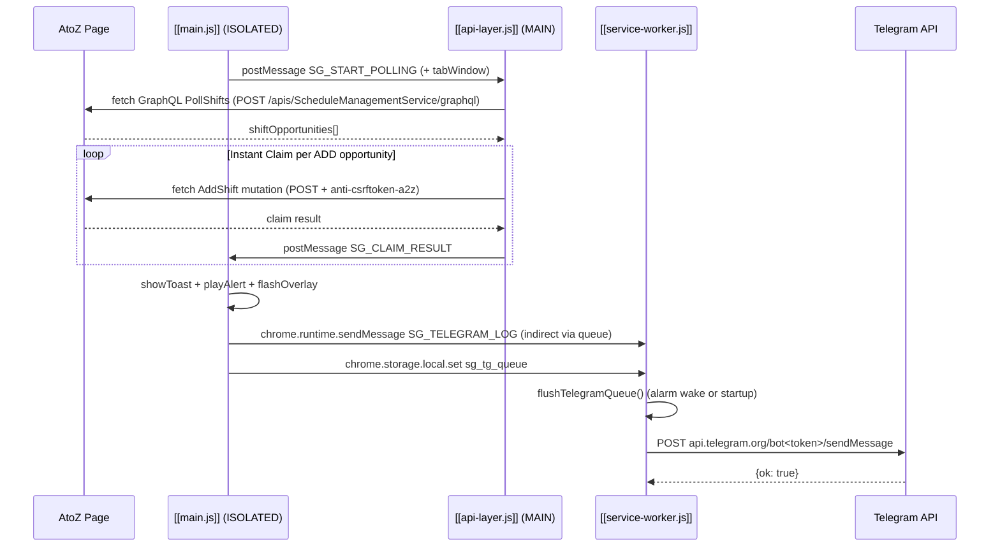
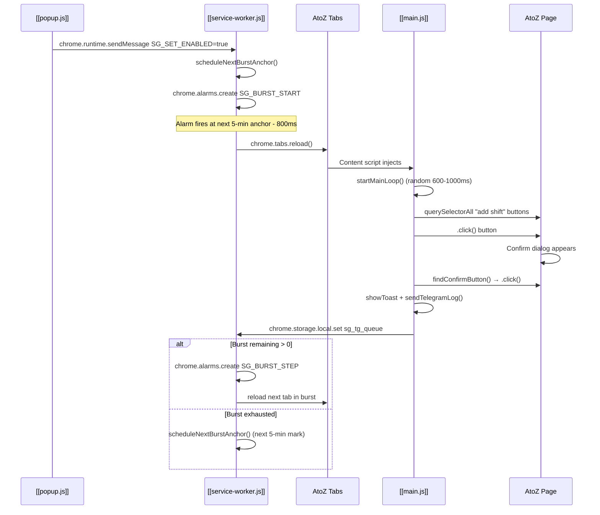

# Data Flow

> **Project:** [[Shift Grabber V9 Index]]  
> **Scope:** Execution flows, message topology, and storage contract across all extension surfaces.  
> **Sources:** [[main.js]], [[api-layer.js]], [[service-worker.js]], [[popup.js]], [[manifest.json]]

## Overview

The extension operates across **three runtime surfaces**:

| Surface | File | World | Role |
|---------|------|-------|------|
| Content (Isolated) | [[main.js]] | `ISOLATED` | HUD, DOM backup clicking, pause/override UX, Telegram queue writer |
| Content (Main) | [[api-layer.js]] | `MAIN` | GraphQL polling, CSRF extraction, instant API claiming |
| Background | [[service-worker.js]] | `SERVICE WORKER` | Alarm scheduling, token refresh, Telegram flush |
| Popup | [[popup.js]] | `POPUP` | License entry, manual controls, blacklist management |

## Execution Flow 1: API-Centric Shift Claim (Primary Path)

**Entry Point:** `api-layer.js` polling loop starts when `main.js` posts `SG_START_POLLING` after detecting a valid token.

| Attribute | Value |
|-----------|-------|
| **Entry Point** | `main.js:613` — `waitForApiLayer()` → `startApiPolling()` → `window.postMessage` |
| **Depth** | 8 hops (`main.js` → `api-layer.js` → Amazon GQL → `api-layer.js` → `main.js` → `chrome.storage` → SW wake → Telegram API) |
| **Criticality** | **CRITICAL** — This is the primary revenue path. If `api-layer.js` fails to inject (MAIN world blocked), no API claiming occurs. |
| **Nodes** | `main.js`, `api-layer.js`, Amazon GQL endpoint, `chrome.storage.local`, `service-worker.js`, Telegram API |

## Execution Flow 2: DOM Backup / Burst Reload Path

**Entry Point:** User enables toggle in popup → service worker schedules `SG_BURST_START` alarm.

| Attribute | Value |
|-----------|-------|
| **Entry Point** | `popup.js:209` — enable toggle change → `SG_SET_ENABLED` |
| **Depth** | 7 hops (popup → SW → alarm → tab reload → `main.js` → DOM click → confirm → queue → SW flush) |
| **Criticality** | **HIGH** — Fallback path when API claim misses or is disabled. DOM clicking is slower and more detectable. |
| **Nodes** | `popup.js`, `service-worker.js`, `chrome.alarms`, `chrome.tabs`, `main.js`, Amazon AtoZ DOM |

## Execution Flow 3: Token Refresh & Recovery

**Entry Point:** `chrome.alarms` `SG_TOKEN_CHECK` fires every 2 minutes.

| Step | Actor | Action | Line Ref |
|------|-------|--------|----------|
| 1 | `service-worker.js` | Alarm `SG_TOKEN_CHECK` fires | `sw:138` |
| 2 | `service-worker.js` | `tryAutoRefreshTokenIfNeeded()` — checks `exp - nowSec > 120` | `sw:325` |
| 3 | `service-worker.js` | `refreshTokenInBackground()` — POST `shift-grabber.vercel.app/verify` with `key + deviceId` | `sw:293` |
| 4a | `service-worker.js` | Success: writes `sg_access_token`, `sg_token_exp` to storage | `sw:311-313` |
| 4b | `service-worker.js` | Failure: sends `SG_REQUEST_TOKEN_REFRESH` to popup (fallback) | `sw:333` |
| 5 | `popup.js` | Receives `SG_REQUEST_TOKEN_REFRESH` → calls `verifyWithServer(key)` | `popup:173` |
| 6 | `main.js` | `updateHUD()` detects token valid + `tokenExpiredPollingStopped === true` | `main:229` |
| 7 | `main.js` | Resumes API polling via `startApiPolling()` | `main:232` |

| Attribute | Value |
|-----------|-------|
| **Entry Point** | `service-worker.js:341` — `ensureTokenCheckAlarm()` on enable / install / startup |
| **Depth** | 5 hops (alarm → SW check → SW refresh → storage → `main.js` HUD loop detects resume) |
| **Criticality** | **CRITICAL** — All scheduling is gated behind token validity. If refresh fails and popup is closed, the extension silently stops. |
| **Nodes** | `chrome.alarms`, `service-worker.js`, `shift-grabber.vercel.app`, `chrome.storage.local`, `main.js` |

## Data Stores: `chrome.storage.local`

| Key | Written By | Read By | Purpose |
|-----|-----------|---------|---------|
| `sg_enabled` | `popup.js` | `main.js`, `service-worker.js` | Master on/off switch |
| `sg_paused` | `popup.js`, `main.js` | `main.js`, `service-worker.js` | Pause state (stops polling) |
| `sg_override` | `popup.js`, `main.js` | `main.js`, `service-worker.js` | Fast/override mode (custom tick speed) |
| `sg_access_token` | `popup.js`, `service-worker.js` | `main.js`, `service-worker.js` | License JWT/token |
| `sg_token_exp` | `popup.js`, `service-worker.js` | `main.js`, `service-worker.js` | Token expiry (unix seconds) |
| `sg_next_due` | `service-worker.js` | `main.js` | Next alarm timestamp for HUD timer |
| `sg_burst_left` | `service-worker.js` | `main.js` | Remaining reloads in current burst |
| `sg_blacklist_dates` | `popup.js`, `main.js` | `api-layer.js` | Dates to skip claiming |
| `sg_dates` | `popup.js` | `popup.js` | User-selected dates to open in tabs |
| `sg_tg_queue` | `main.js` | `service-worker.js` | Pending Telegram notification queue |
| `sg_eid` | `main.js` | `service-worker.js` | Employee ID extracted from localStorage |
| `sg_hud_hidden` | `main.js` | `main.js` | HUD visibility preference |
| `SG_userKey` | `popup.js` | `popup.js`, `service-worker.js` | License key entered by user |
| `SG_deviceId` | `popup.js` | `popup.js`, `service-worker.js` | UUID generated per install |

## Message Types Table

| Type | Sender | Receiver | Purpose |
|------|--------|----------|---------|
| `SG_START_POLLING` | `main.js` | `api-layer.js` (postMessage) | Begin GraphQL polling with interval + window |
| `SG_STOP_POLLING` | `main.js` | `api-layer.js` (postMessage) | Halt polling loop |
| `SG_SET_SPEED` | `main.js` | `api-layer.js` (postMessage) | Change poll interval (turbo mode) |
| `SG_SET_BLACKLIST_DATES` | `popup.js` → `main.js` | `api-layer.js` (postMessage) | Propagate date blacklist |
| `SG_EID` | `api-layer.js` | `main.js` → `service-worker.js` | Relay employee ID from localStorage |
| `SG_CLAIM_RESULT` | `api-layer.js` | `main.js` (postMessage) | Report success/failure of API claim |
| `SG_RATE_LIMITED` | `api-layer.js` | `main.js` (postMessage) | Notify 429 backoff state |
| `SG_SET_ENABLED` | `popup.js` | `service-worker.js` | Toggle extension on/off |
| `SG_SET_PAUSED` | `popup.js`, `main.js` | `service-worker.js` | Toggle pause state |
| `SG_SET_OVERRIDE` | `popup.js`, `main.js` | `service-worker.js` | Toggle override/fast mode |
| `SG_RELOAD_ALL_NOW` | `popup.js`, `main.js` | `service-worker.js` | Immediate tab reload (if token valid) |
| `SG_LICENSE_VERIFIED` | `popup.js` | `service-worker.js` | License check result; triggers reschedule |
| `SG_POKE_SCHEDULE` | `main.js` | `service-worker.js` | Request immediate schedule recalculation |
| `SG_REQUEST_TOKEN_REFRESH` | `service-worker.js` | `popup.js` | Fallback token refresh (popup must be open) |
| `SG_TOGGLE_HUD` | `popup.js` | `main.js` | Toggle HUD visibility |
| `SG_TOGGLE_PAUSE` | `popup.js` | `main.js` | Toggle pause (keyboard shortcut relay) |
| `SG_TOGGLE_OVERRIDE` | `popup.js` | `main.js` | Toggle override (keyboard shortcut relay) |

## Related Maps

- [[Security Audit]] — Security surfaces for each flow
- [[License & Token Lifecycle]] — Deep-dive on token refresh state machine
- [[Dependency Graph]] — Cross-file dependency overview
- [[Architecture Map]] — High-level component topology
- [[main.js]]
- [[api-layer.js]]
- [[service-worker.js]]
- [[popup.js]]
- [[Popup UI]]
- [[license.js]]
- [[Configuration Reference]] — Timing and storage constants
- [[Technical Debt Register]] — Known flow weaknesses
- [[External API Contracts]] — Request/response schemas
- [[Project Evolution]] — How flows changed across versions
- [[Shift Grabber V9 Index]]
- [[Master Document]]
