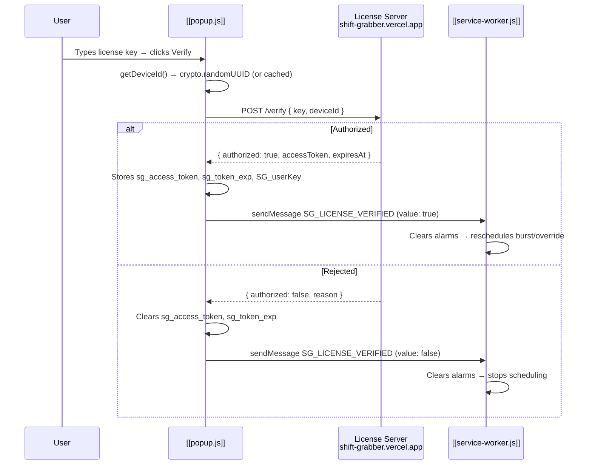
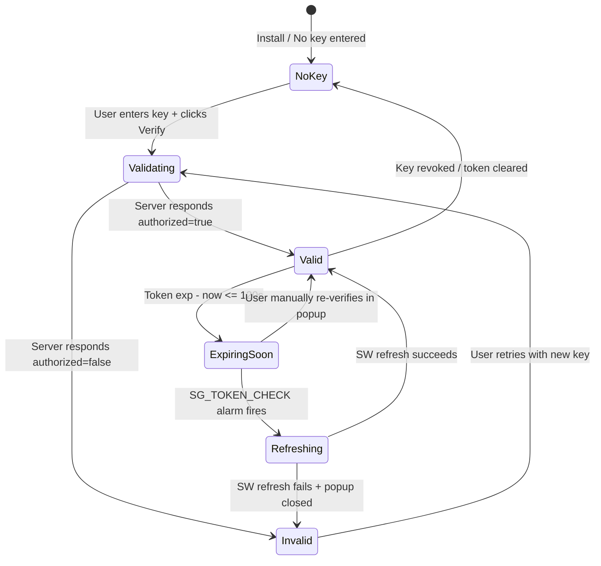

# License & Token Lifecycle

> **Project:** [[Shift Grabber V9 Index]]  
> **Scope:** License verification, token storage, refresh strategies, expiry gating, and failure modes.  
> **Sources:** [[popup.js]], [[service-worker.js]], [[main.js]]

## 1. License Verification Flow

- **File:** `popup.js`  
- **Lines:** `54-82` (`verifyWithServer`)  
- **Server:** `https://shift-grabber.vercel.app/verify` (hardcoded, line 39)  
- **Request body:** `{ key: string, deviceId: UUID }`  
- **Success response:** `{ authorized: true, accessToken?: string, expiresAt?: number }`  
- **Fallback token generation:** If server omits `accessToken`/`expiresAt`, popup generates `crypto.randomUUID()` and `now + 600s` (line 74-75). This is a **degraded trust path** — the client self-issues a token when the server does not provide one.

## 2. Token Storage Contract

| Key | Type | Writer | Reader | Lifetime |
|-----|------|--------|--------|----------|
| `sg_access_token` | `string` (JWT-like or UUID) | `popup.js`, `service-worker.js` | `main.js`, `service-worker.js` | Until expiry or revocation |
| `sg_token_exp` | `number` (unix seconds) | `popup.js`, `service-worker.js` | `main.js`, `service-worker.js` | Same as above |
| `SG_userKey` | `string` | `popup.js` | `popup.js`, `service-worker.js` | Indefinite |
| `SG_deviceId` | `string` (UUID) | `popup.js` | `popup.js`, `service-worker.js` | Indefinite |

**Storage medium:** `chrome.storage.local` (unencrypted, device-local).

## 3. Token Refresh Strategy

### Primary Path: Service Worker Background Refresh

- **File:** `service-worker.js`  
- **Lines:** `293-320` (`refreshTokenInBackground`)  
- **Trigger:** `SG_TOKEN_CHECK` alarm every 2 minutes (line 341)  
- **Threshold:** Refresh only when `exp - nowSec <= 120` (line 329)  
- **Mechanism:** SW directly POSTs `/verify` with stored `SG_userKey` + `SG_deviceId` — **no popup required**.  
- **Outcome:** Updates `sg_access_token` and `sg_token_exp` atomically via `setState`.

### Fallback Path: Popup Refresh

- **File:** `service-worker.js`  
- **Lines:** `331-334`  
- **Trigger:** Only if SW background refresh returns `false`  
- **Mechanism:** Sends `SG_REQUEST_TOKEN_REFRESH` to popup  
- **Limitation:** **Popup must be open** to receive the message. If closed, refresh fails and extension remains in expired state.

### Check Interval

- **Alarm name:** `SG_TOKEN_CHECK`  
- **Period:** Every 2 minutes (`periodInMinutes: 2`, line 341)  
- **Initial delay:** 1 minute (`delayInMinutes: 1`, line 341)  
- **Rationale:** `setInterval` does not survive MV3 service worker termination; alarms do.

## 4. Token Gating

Scheduling functions **return early** if token is missing or expired:

| Function | File | Lines | Gate Condition |
|----------|------|-------|----------------|
| `scheduleNextBurstAnchor` | `service-worker.js` | `116-117` | `!st[ACCESS_TOKEN] \|\| !st[TOKEN_EXP] \|\| st[TOKEN_EXP] <= nowSec` |
| `startOverrideTick` | `service-worker.js` | `127-128` | Same |
| `alarm router` | `service-worker.js` | `146-147` | Same |
| `SG_BURST_STEP` | `service-worker.js` | `169` | Same |
| `SG_OVERRIDE_TICK` | `service-worker.js` | `185` | Same |
| `SG_RELOAD_ALL_NOW` | `service-worker.js` | `258` | Same |
| `init()` HUD check | `main.js` | `593` | If no valid `next_due`, pokes SW only if enabled |

**Result:** Without a valid token, the extension is **cosmetically active but functionally inert**. The HUD shows "NO KEY" (line 257).

## 5. Token Expiry Guard in main.js

- **File:** `main.js`  
- **Lines:** `220-235` (inside `updateHUD()`)  
- **Logic:**
  - If enabled + not paused + no valid token + `!tokenExpiredPollingStopped` → `stopApiPolling()` + set flag
  - If enabled + not paused + valid token + `tokenExpiredPollingStopped === true` → `startApiPolling()` + clear flag
- **Frequency:** Checked every 500ms (HUD update interval, line 600).
- **Purpose:** Prevents `api-layer.js` from spamming Amazon with requests that would return 401/403 after token expiry, which increases bot-detection risk.

## 6. Failure Modes

| Scenario | Behavior | Recovery |
|----------|----------|----------|
| **Network down during refresh** | SW refresh fails → popup fallback fails (if closed) → token expires | User must open popup and click Verify manually |
| **Server rejects key (revoked)** | `/verify` returns `!authorized` → token cleared → scheduling stops | User must purchase/enter new key |
| **Server returns 500** | SW refresh fails; no token update | Alarm retries in 2 minutes |
| **Client clock skew** | `exp <= nowSec` may be true early or late | No NTP sync; relies on local clock |
| **SW terminated mid-refresh** | `fetch` may complete after SW restart; alarm fires again safely | Idempotent write to storage |
| **Token self-issued (server fallback)** | `crypto.randomUUID()` used with `now + 600s` | Token is meaningless cryptographically; only local expiry check validates it |

## 7. State Machine

| State | Indicator | API Polling | Scheduling |
|-------|-----------|-------------|------------|
| No Key | HUD: "NO KEY" | ❌ Stopped | ❌ None |
| Valid | HUD: "LIVE" / "FAST" | ✅ Running | ✅ Active |
| Expiring Soon | HUD: still "LIVE" | ✅ Running | ✅ Active |
| Refreshing | HUD: unchanged | ✅ Running | ✅ Active (old token still valid) |
| Invalid | HUD: "NO KEY" | ❌ Stopped | ❌ None |

## Related Documents

- [[Security Audit]] — Secrets exposure and transport risks for license server
- [[popup.js]] — UI for license entry
- [[license.js]] — Background verification logic
- [[service-worker.js]] — Background refresh implementation
- [[main.js]] — Token expiry guard and auto-resume
- [[Architecture Map]] — Trust boundaries between popup, SW, and content
- [[Configuration Reference]] — Token-related storage keys and thresholds
- [[Technical Debt Register]] — Token refresh race condition and duplication
- [[External API Contracts]] — License server API contract
- [[Project Evolution]] — When license system was introduced
- [[Shift Grabber V9 Index]]
- [[Master Document]]
