# Shift Grabber V9 Index

**Shift Grabber V9** is a Manifest V3 Chrome Extension that automates shift polling, claiming, and notifications via GraphQL injection, background alarms, and a persistent content-script HUD.

- **Version**: v2.0.0
- **Vault Format**: Flat Obsidian structure with index aggregators
- **Last Updated**: 2026-04-22

## Vault Map

```mermaid
graph TB
    IDX[[Shift Grabber V9 Index]]
    COMP[[Components Index]]
    FLOW[[Flows Index]]
    GVIEW[[Graph View]]

    MAN[[manifest.json]]
    MAIN[[main.js]]
    API[[api-layer.js]]
    SW[[service-worker.js]]
    POP[[popup.js]]
    PUI[[Popup UI]]
    LICJS[[license.js]]
    ASS[[Assets & Resources]]
    DEV[[Development & Deployment]]
    MSGBUS[[Message Router & State Bus]]
    STATE[[State & Storage Model]]
    MV3[[MV3 Platform Constraints]]
    PERF[[Performance Characteristics]]
    WORK[[Work Log]]

    ARCH[[Architecture Map]]
    DEP[[Dependency Graph]]
    MOD[[Module Analysis]]

    DF[[Data Flow]]
    SEC[[Security Audit]]
    LIC[[License & Token Lifecycle]]

    IDX --> COMP
    IDX --> FLOW
    IDX --> GVIEW

    COMP --> MAN
    COMP --> MAIN
    COMP --> API
    COMP --> SW
    COMP --> POP

    FLOW --> DF
    FLOW --> SEC
    FLOW --> LIC

    ARCH --> MAN
    ARCH --> MAIN
    ARCH --> API
    ARCH --> SW
    ARCH --> POP

    DEP --> MAN
    DEP --> MAIN
    DEP --> API
    DEP --> SW
    DEP --> POP

    MOD --> MAN
    MOD --> MAIN
    MOD --> API
    MOD --> SW
    MOD --> POP

    DF --> MAIN
    DF --> API
    DF --> SW
    DF --> POP

    SEC --> SW
    SEC --> API
    SEC --> LIC

    LIC --> SW

    style IDX fill:#fde047,stroke:#b45309,stroke-width:3px
    style COMP fill:#fde047,stroke:#b45309,stroke-width:2px
    style FLOW fill:#fde047,stroke:#b45309,stroke-width:2px
    style GVIEW fill:#fde047,stroke:#b45309,stroke-width:2px
    style MAN fill:#93c5fd,stroke:#1d4ed8,stroke-width:2px
    style MAIN fill:#93c5fd,stroke:#1d4ed8,stroke-width:2px
    style API fill:#93c5fd,stroke:#1d4ed8,stroke-width:2px
    style SW fill:#93c5fd,stroke:#1d4ed8,stroke-width:2px
    style POP fill:#93c5fd,stroke:#1d4ed8,stroke-width:2px
    style PUI fill:#93c5fd,stroke:#1d4ed8,stroke-width:2px
    style LICJS fill:#93c5fd,stroke:#1d4ed8,stroke-width:2px
    style ASS fill:#93c5fd,stroke:#1d4ed8,stroke-width:2px
    style DEV fill:#93c5fd,stroke:#1d4ed8,stroke-width:2px
    style MSGBUS fill:#c4b5fd,stroke:#7c3aed,stroke-width:2px
    style STATE fill:#c4b5fd,stroke:#7c3aed,stroke-width:2px
    style MV3 fill:#c4b5fd,stroke:#7c3aed,stroke-width:2px
    style PERF fill:#c4b5fd,stroke:#7c3aed,stroke-width:2px
    style WORK fill:#c4b5fd,stroke:#7c3aed,stroke-width:2px
    style ARCH fill:#86efac,stroke:#15803d,stroke-width:2px
    style DEP fill:#86efac,stroke:#15803d,stroke-width:2px
    style MOD fill:#86efac,stroke:#15803d,stroke-width:2px
    style DF fill:#fca5a5,stroke:#b91c1c,stroke-width:2px
    style SEC fill:#fca5a5,stroke:#b91c1c,stroke-width:2px
    style LIC fill:#fca5a5,stroke:#b91c1c,stroke-width:2px

    MD[[Master Document]]
    CFG[[Configuration Reference]]
    APICTR[[External API Contracts]]
    DEBT[[Technical Debt Register]]
    EVOL[[Project Evolution]]

    MD --> IDX
    MD --> COMP
    MD --> FLOW
    MD --> ARCH
    MD --> SEC

    style MD fill:#c4b5fd,stroke:#7c3aed,stroke-width:2px
    style CFG fill:#c4b5fd,stroke:#7c3aed,stroke-width:2px
    style APICTR fill:#c4b5fd,stroke:#7c3aed,stroke-width:2px
    style DEBT fill:#c4b5fd,stroke:#7c3aed,stroke-width:2px
    style EVOL fill:#c4b5fd,stroke:#7c3aed,stroke-width:2px
```

## Table of Contents

### Components
Source code notes covering every runtime artifact of the extension.

- [[manifest.json]] — MV3 manifest, permissions, and host matches
- [[main.js]] — Content script (HUD, DOM backup, keyboard shortcuts)
- [[api-layer.js]] — GraphQL polling & claiming (MAIN world)
- [[service-worker.js]] — Background scheduler, token refresh, Telegram
- [[popup.js]] — Control panel logic
- [[Popup UI]] — Popup HTML/CSS visual architecture
- [[license.js]] — Background license verification helper
- [[Assets & Resources]] — Icons, sounds, and web-accessible resources
- [[Development & Deployment]] — Loading, debugging, and shipping the extension
- [[Message Router & State Bus]] — Every message, payload, sender, receiver
- [[State & Storage Model]] — How storage acts as the state machine
- [[MV3 Platform Constraints]] — How Manifest V3 shaped every design decision
- [[Performance Characteristics]] — Latency, load, bandwidth, scaling limits
- [[Error Handling & Resilience]] — How failures are handled across all modules
- [[Work Log]] — Chronological record of knowledge graph work

### Reference
Complete registers and contracts.

- [[Master Document]] — Canonical single source of truth
- [[Configuration Reference]] — All tunable constants and storage keys
- [[External API Contracts]] — Amazon GraphQL, license server, Telegram
- [[Technical Debt Register]] — Known issues and remediation tracker
- [[Project Evolution]] — Version history and architectural migrations

### Architecture
System-level analysis and structural documentation.

- [[Architecture Map]] — Module boundaries, depth, and coupling analysis
- [[Dependency Graph]] — Internal and external dependencies
- [[Module Analysis]] — Cohesion ratings and dependency categorization

### Flows & Security
Execution tracing, security posture, and token lifecycle.

- [[Data Flow]] — Message types, execution flows, and data stores
- [[Security Audit]] — Secrets, permissions, CSRF, and rate-limit review
- [[License & Token Lifecycle]] — Token state machine and refresh strategy

### Navigation
Index notes and graph guidance.

- [[Components Index]] — Aggregated component directory
- [[Flows Index]] — Aggregated flow and security directory
- [[Graph View]] — How to read the vault graph and suggested pathways
- [[Development & Deployment]] — Developer workflow and debugging

### Navigation
- [[Master Document]] — Start here for a compressed overview of everything
- `../master.md` — Root-level canonical reference (outside vault)

## How to Use This Vault

1. **Start here** — This note links to every other note in the vault. No orphaned pages.
2. **Open Graph View** — Press `Ctrl/Cmd + G` (or the graph icon) to see the full knowledge graph. Colored clusters match the legend in [[Graph View]].
3. **Use Local Graph** — Open the local graph pane on any note to see its immediate neighbors without noise.
4. **Follow a pathway** — Depending on your role, pick a curated trail from [[Graph View]].
5. **Drill down** — Index notes provide summaries; detailed analysis lives in the leaf notes.

## Recent Changes

| Version | Date | Change |
|---------|------|--------|
| v2.0.0 | 2026-04-22 | Rebuilt vault as flat Obsidian graph with Mermaid map, index aggregators, and cross-linked wikilinks. |
| v2.1.0 | 2026-04-22 | Commercial SaaS transformation: Stripe subscriptions, stealth engine overhaul, circuit breaker, subscription UI. |

## Related Notes

- [[Components Index]]
- [[Flows Index]]
- [[Graph View]]
- [[Architecture Map]]
- [[Security Audit]]
- [[Master Document]]
- [[Configuration Reference]]
- [[Technical Debt Register]]
- [[Security Hardening v2.1]]
- [[UI Design System]]
- [[Commercial Architecture]]

#chrome-extension #manifest-v3 #shift-grabber #knowledge-graph
